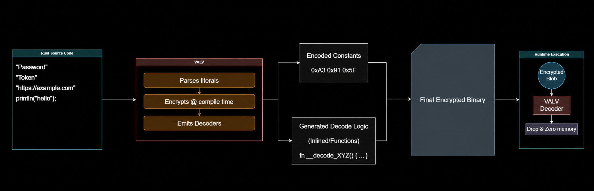

<h1 align="center">Valv</h1>
<p align="center"><b>Compile-Time String Encryption for Rust</b></p>

<p align="center">
  
  
  
  <a href="https://ryftenius.com">
    
  </a>
</p>

<p align="center">
Turns string literals into encrypted blobs at compile time and materializes plaintext only inside short runtime closures.
</p>



## Overview

Valv is a Rust framework for compile-time string encryption. Its macros replace
literal strings with encrypted byte material during compilation, then expose
the decrypted value only inside a short closure at runtime.

- Compile-time encryption through ergonomic proc macros.
- Closure-scoped plaintext access with zeroization on drop.
- ChaCha20, Ascon, AES-GCM, XOR Mask, and Stream Mask engines.
- Runtime-bound encryption with externally supplied key material.
- Stable Rust, `no_std`, deterministic-build, and release-hardening support.

## Install

```toml
[dependencies]
valv = "2.0.0"
```

The default feature set is `std` + `chacha` + `timing_guard`.

## Quick Start

```rust
use valv::chacha;

fn main() {
    let secret = chacha!("database.internal.example");

    secret.with_str(|value| {
        assert_eq!(value, "database.internal.example");
    });
}
```

`SecretText::with_str` decrypts, runs the closure, and drops the zeroizing `SecretStr` immediately after the closure returns.

## Before And After

The included probes compile the same marker as a normal Rust literal and with
`chacha!`. A stripped release build makes the difference visible directly in
radare2:

```bash
cargo build --release --example plaintext_probe --example security_probe

cp target/release/examples/plaintext_probe /tmp/plaintext-probe
cp target/release/examples/security_probe /tmp/valv-probe
strip --strip-all /tmp/plaintext-probe /tmp/valv-probe

r2 -q -e bin.relocs.apply=true \
  -c 'izz~offline-recovery-check' /tmp/plaintext-probe
r2 -q -e bin.relocs.apply=true \
  -c 'izz~offline-recovery-check' /tmp/valv-probe
```

Plaintext literal:

```text
88  0x00005838  0x00005838  51  52  .rodata  ascii  VALV_AUDIT_TOKEN: offline-recovery-check-2026-07-26
```

Valv-protected literal:

```text
no matches
```

The normal build stores the marker directly in `.rodata`; the Valv build does
not expose it in radare2's indexed strings.

## Runtime-Bound Secrets

Use the opt-in `runtime_bound` mode when the binary must not contain everything
needed to decrypt a literal. The `bound!` and `boundex!` macros encrypt with
`VALV_BUILD_PEPPER` during compilation, but emit only authenticated ciphertext
and a nonce. Runtime decryption requires matching external key material:

```toml
[dependencies]
valv = { version = "2.0.0", default-features = false, features = ["std", "runtime_bound", "timing_guard"] }
```

```rust
use valv::bound;

fn main() -> Result<(), Box<dyn std::error::Error>> {
    let endpoint = bound!("https://private.internal.example");
    let runtime_key = std::env::var("VALV_RUNTIME_PEPPER")?;

    endpoint.with_str(runtime_key.as_bytes(), |value| {
        assert_eq!(value, "https://private.internal.example");
    })?;

    Ok(())
}
```

`VALV_BUILD_PEPPER` and the runtime key material must match and contain at least
32 bytes. Supply them from a credential manager, HSM, TPM, protected CI secret,
or another source outside the binary.

```bash
VALV_BUILD_PEPPER="$(cat /secure/path/valv.pepper)" \
  cargo build --release --no-default-features \
  --features "std,runtime_bound,timing_guard"
```

Changing the build pepper requires a clean rebuild of consumers that invoke the
macro. Runtime-bound mode keeps its matching runtime material outside the
compiled binary.

## Timing Guard

Default builds enable the fail-closed `timing_guard` feature. Custom feature
sets can enable it explicitly:

```toml
[dependencies]
valv = { version = "2.0.0", default-features = false, features = ["std", "chacha", "timing_guard"] }
```

The guard measures the decryption phase and plaintext closure separately using
a monotonic clock. If either phase takes more than 250 ms, Valv drops the
plaintext and closure output before terminating with exit code 70. Guarded
closures should stay short and free of blocking I/O. The feature requires
`std` and can be disabled through custom feature selection.

## Embedded-Key Macros

Each engine provides a single-string macro and a multi-string macro:

| Engine | Single | Multi |
| --- | --- | --- |
| ChaCha20 | `chacha!` | `chachaex!` |
| Ascon | `ascon!` | `asconex!` |
| AES-GCM | `aesgcm!` | `aesgcmex!` |
| XOR Mask | `xormask!` | `xormaskex!` |
| Stream Mask | `streammask!` | `streammaskex!` |

```rust
use valv::chachaex;

let values = chachaex!("alpha", "bravo", "charlie");
values[0].with_str(|value| assert_eq!(value, "alpha"));
```

## Embedded-Key Engines

| Engine | Intended Use | Integrity | Notes |
| --- | --- | --- | --- |
| `chacha` | Default general-purpose literal protection | Yes | ChaCha20 + BLAKE3 MAC + post-encryption mutation. |
| `ascon` | ASCON-based alternative | Yes | ASCON128 + KMAC256/BLAKE3-derived keys. |
| `aesgcm` | AES-GCM users | Yes | AES-256-GCM + BLAKE3 MAC over raw GCM output. |
| `streammask` | Lightweight obfuscation | No | ChaCha20 stream masking with the build key carried in the tag field. |
| `xormask` | Deterministic obfuscation | No | Reversible XOR transform derived from the seed. |

Enable only the engines you need so unused crypto crates are not linked:

```toml
[dependencies]
valv = { version = "2.0.0", default-features = false, features = ["std", "aesgcm"] }
```

## Deterministic Builds

`valv_macros` has a `deterministic` feature for reproducible macro output. Set `VALV_BUILD_SEED` to control the deterministic seed:

```bash
VALV_BUILD_SEED="release-2026-07-26" cargo build --features "std,chacha,valv_macros/deterministic"
```

If the feature is enabled without `VALV_BUILD_SEED`, Valv uses a fixed fallback seed so docs.rs and `cargo test --all-features` remain buildable. Do not use that fallback for release builds that rely on output uniqueness.

## Consumer Release Hardening

For applications that embed Valv-protected strings, prefer a release profile like this:

```toml
[profile.release]
lto = "fat"
codegen-units = 1
strip = "symbols"
panic = "abort"
opt-level = "z"
```

This combines link-time optimization, single-unit code generation, symbol
stripping, abort-on-panic behavior, and size-focused optimization.

## Verification

`tests/stripped_probe.rs` automates the release build, stripping, and static
literal checks on Linux. `tests/runtime_bound_macro.rs` builds a consumer of
`bound!`, verifies the release artifact, and checks matching and non-matching
runtime key behavior. Reproducible command output is recorded in
[docs/SECURITY_REVIEW.md](docs/SECURITY_REVIEW.md).

## Crate Layout

- `valv`: user-facing facade crate, re-exporting macros and core types.
- `valv_core`: runtime engines, `SecretText`, `SecretStr`, and engine traits.
- `valv_macros`: proc macros that encrypt literals at compile time.

## Publishing

The workspace is configured for crates.io packaging. Publish in dependency order:

```bash
cargo publish -p valv_core
cargo publish -p valv_macros
cargo publish -p valv
```

Run the preflight in [docs/PUBLISHING.md](docs/PUBLISHING.md) before publishing.

## Name

**Valv** is the project and crate-family name. The published package names are
`valv`, `valv_core`, and `valv_macros`. The existing GitHub repository URL
continues to use `Regera` until the remote repository is renamed.

## License

AGPL-3.0-only. See [LICENSE](LICENSE).
