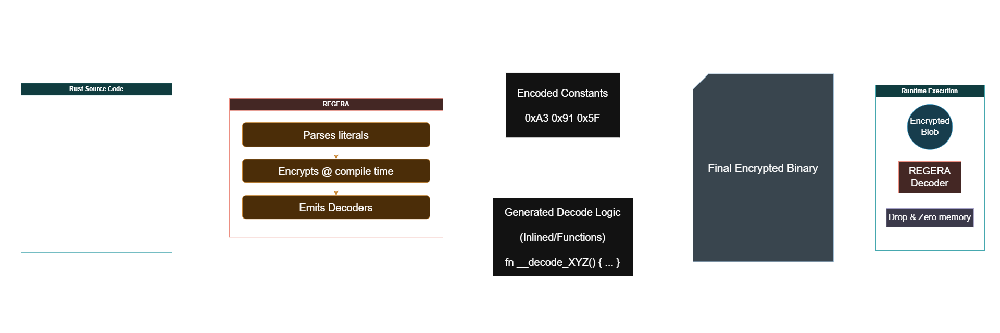

# Regera

[](https://titansoftwork.com)

Compile-time string encryption for Rust.

Regera turns string literals into encrypted blobs at build time and wires in tiny decrypt shims at runtime. Single-value macros return a zeroizing `SecretStr`; multi-value macros return owned `String`s for ergonomic destructuring.

---



## Features

- **Compile-time encrypted literals** via proc macros (`jesko!`, `absolut!`, `sadair!`, `gamera!`).
- **Multiple engines**, tuned for different trade-offs:
  - `jesko`   – ChaCha20 + BLAKE3 MAC + obfuscation
  - `absolut` – ASCON128 + KMAC256 + obfuscation
  - `sadair`  – AES-256-GCM + BLAKE3 MAC + obfuscation
  - `gamera`  – non-cryptographic XOR obfuscator (for low-risk data)
- **Zeroizing secrets**: single macros return `SecretStr`, which wipes memory on drop.
- **Multi-string macros** (`*ex!`) for bundling several literals behind one engine call.

---

## Crate layout

- **`regera`**  
  Umbrella crate. Re-exports macros and core types for normal use.

- **`regera_macros`**  
  Proc-macro crate. Encrypts literals at compile time and emits decrypt shims.

- **`regera_core`**  
  Runtime core. Engines, `Encryptor` trait, `SecretStr`, and shared plumbing.

---

## Install

Using the umbrella crate:

```toml
[dependencies]
regera = "0.1.0"
````

Or, if you want the pieces separately:

```toml
[dependencies]
regera_core   = "0.1.0"
regera_macros = "0.1.0"
```

Workspace / local development:

```toml
[dependencies]
regera        = { path = "./regera" }
regera_core   = { path = "./regera_core" }
regera_macros = { path = "./regera_macros" }
```

---

## Quick start

```rust
use regera::{jesko, jeskoex};

fn main() {
    // Single literal -> SecretStr (zeroizing wrapper)
    let secret = jesko!("MySecretData");

    // Multiple literals -> [String; 2]
    let [k1, k2]: [String; 2] = jeskoex!("KeyOne", "KeyTwo");

    println!("secret: {}", secret);   // Display impl on SecretStr
    println!("k1: {}", k1);
    println!("k2: {}", k2);
}
```

> Security note: `jesko!` / `absolut!` / `sadair!` return `SecretStr` by default.
> The `*ex!` variants return `[String; N]` and intentionally **do not** zeroize; use them only for non-sensitive data or test fixtures.

---

## Engine macros

| Macro        | Engine                                             | Notes                                   |
| ------------ | -------------------------------------------------- | --------------------------------------- |
| `jesko!()`   | ChaCha20 + BLAKE3 MAC + keyed XOR obfuscation      | Hardened, “stealth”-biased              |
| `absolut!()` | ASCON-AEAD128 + KMAC256 + BLAKE3 MAC + obfuscation | Hardened, no_std-friendly               |
| `sadair!()`  | AES-256-GCM + BLAKE3 MAC + obfuscation             | Hardened, AES-GCM profile               |
| `gamera!()`  | Deterministic XOR-based obfuscator                 | Non-crypto, fast, for low-risk literals |

Multi-string variants (`jeskoex!`, `absolutex!`, `sadairex!`, `gameraex!`) return `[String; N]`.

---

## Using the core directly

If you need to drive engines yourself (e.g. for dynamic data), call them via `regera_core`:

```rust
use regera_core::{engines::sadair::Sadair, Encryptor};

let seed: u64 = 0xDEAD_BEEF_F00D_1234;

let (ct, tag32, frag, mask) = Sadair::encrypt(b"payload", seed);

let plaintext = Sadair::decrypt(&ct, &tag32, frag, mask, seed);
assert_eq!(&*plaintext, "payload"); // SecretStr -> &str via Deref
```

See the `regera_core` docs for full engine list and trait details.

---

## Diagnostics

A small diagnostic binary exercises each engine and prints human-readable output.

From the workspace root:

```bash
cargo run -p regera_spec
```

Example output:

```text
============================================================
 REGERA ENGINE DIAGNOSTIC
------------------------------------------------------------
[ JESKO ENGINE ]
  Primary macro   : jesko!(...)
  Sample output   : ...

[ ABSOLUT ENGINE ]
  Primary macro   : absolut!(...)
  Sample output   : ...

...
============================================================
 DIAGNOSTIC RESULT : OK
============================================================
```

---

## Testing

Run everything:

```bash
cargo test --workspace
```

For just the spec/diagnostic crate:

```bash
cargo test -p regera_spec
```

---

## License

Regera is licensed under the **GNU Affero General Public License v3.0** (AGPL-3.0).
See [LICENSE](./LICENSE) for the full text.

```text
SPDX-License-Identifier: AGPL-3.0-or-later
Copyright © 2025 TITAN Softwork Solutions
```

---

## Contributing

Pull requests are welcome:

1. Fork the repo.
2. Branch with a clear name (`feature/add-foo`, `fix/sadair-mac-path`, …).
3. Run `cargo fmt` and `cargo clippy --all` before opening the PR.
4. Include tests or diagnostics that cover your changes.
